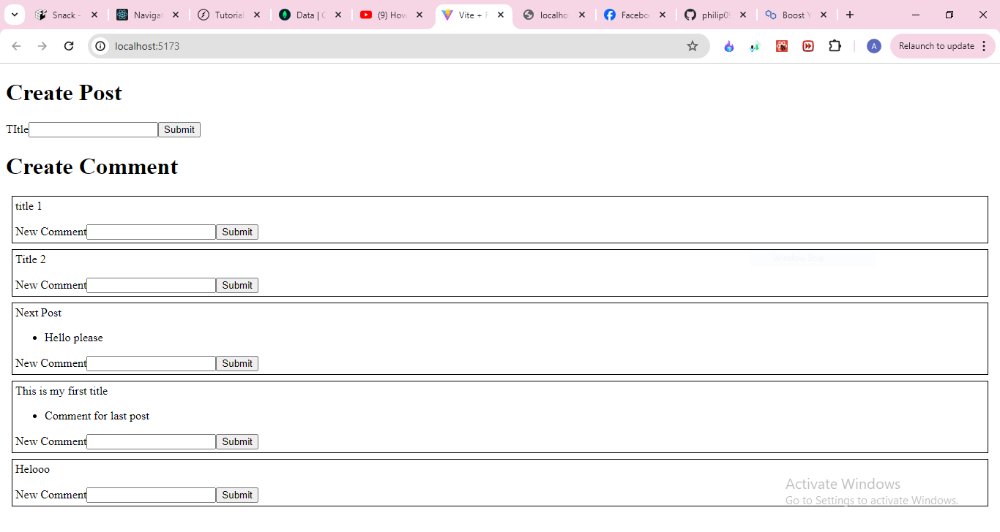

## Post and Comment functionality Microservices

### Technologies :

React ( Vite ) , Express js , MongoDB ( MERN Stack)

### Description :

This is a small full stack microservice project which have the functionality of POST and COMMENT like we do in our social media apps like facebook , instagram etc.

As mentioned above microservice architecture is integrated in this project like we have two servers.

Server 1 : For Post
Server 2 : For Comment

### Sample Image :

### Note

Styling was not considered as priority
